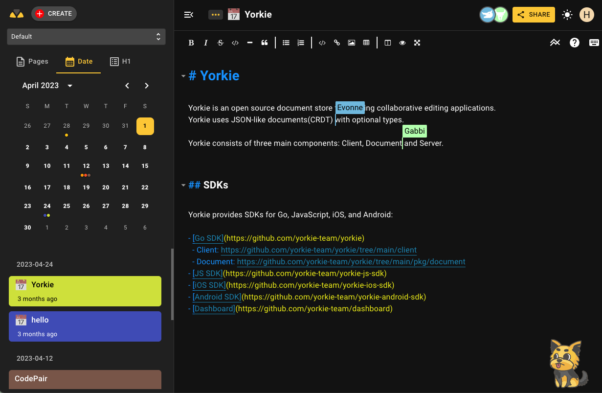

# CodePair

Real-time collaborative code editor with brush tools for online coding interviews or meetings.



## Developing CodePair
For building CodePair, You'll first need Node.js installed(Node.js version 16+ and npm version 7.10+ are required).

CodePair requires local applications such as Envoy, Yorkie and MongoDB. To start them:

```
docker-compose -f docker/docker-compose.yml up --build -d
```

Next, Let's starts CodePair in the development mode.

```
cd webapp
npm install
npm start
```

## Deploying

When PR is merged into main, it is automatically distributed by GitHub Actions.

### Layout

CodePair is deployed to AWS and the configuration is shown below. This repository is used to distribute static pages.

```
[Route53]
 ㄴ codepair.yorkie.dev - [gh-pages] # for serving static pages
 ㄴ api.yorkie.dev      - [EKS]      # for serving API
```
